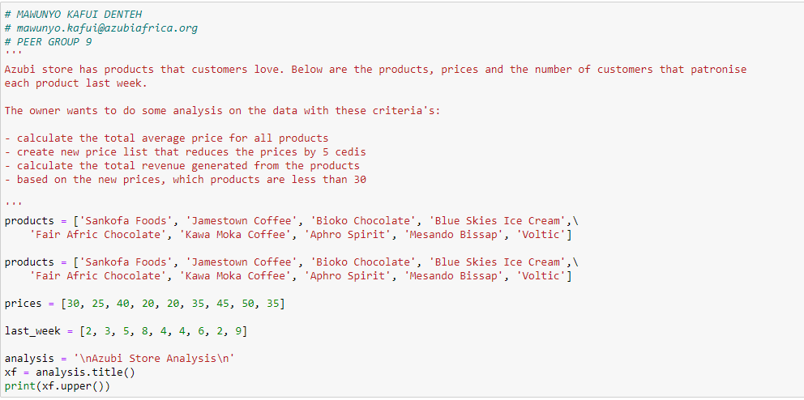
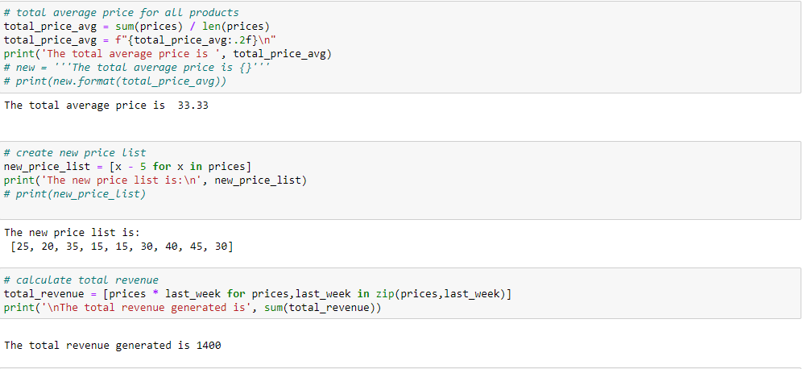
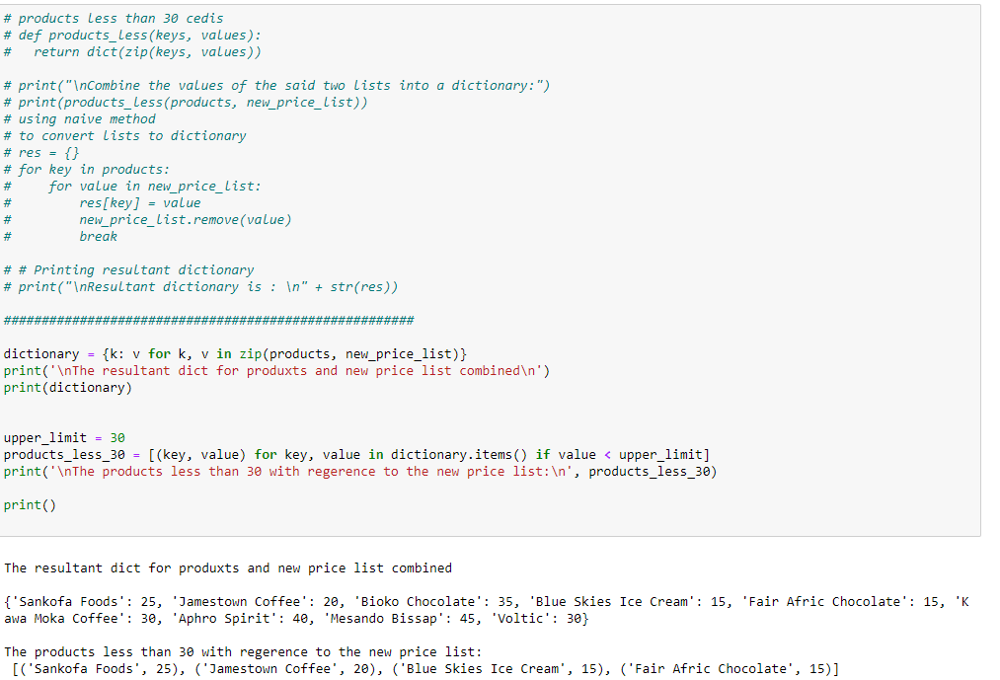

# Sample-Store-Analysis
Analyzing products. price and sales of a shop

## Setting various variables for the stores data

Setting the variables with the various lists which contains different products from the product variables, and the prices  thereof

Calculating the average price for the products   and the total sales from the dataset

Creating a new dictionary and new price list together

